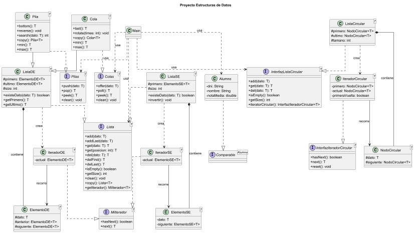

# Trabajo Estructuras de Datos

**Autores:** Héctor Montero Plaza, Guillermo Salgado Malcuori, Álvaro Martínez del Campo

Este proyecto, realizado para la asignatura de Estructuras de Datos, consiste en la implementación en Java de varias estructuras como Lista Simplemente Enlazada, Lista Doblemente Enlazada, Pila o Cola.

Se han desarrollado y probado distintas operaciones básicas como inserción, borrado, búsqueda, recorrido de elementos y copia de estructuras.

Además, el trabajo incluye un **diagrama UML** con las clases, interfaces y relaciones principales del proyecto.

## Ejecución
Para probar el proyecto, basta con compilar los archivos Java y ejecutar la clase `Main`.